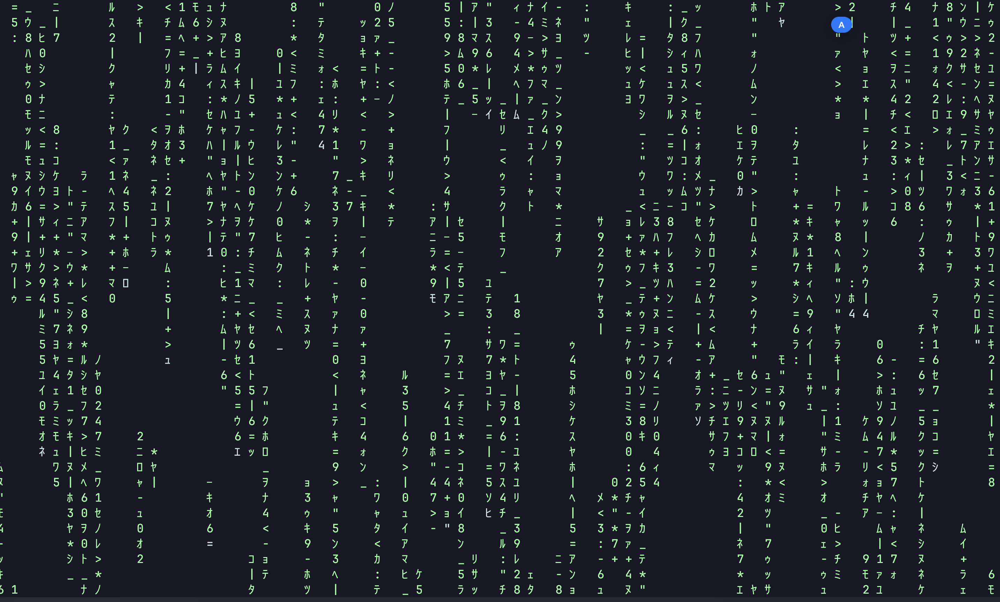

# AstroNvim Template

**NOTE:** This is for AstroNvim v4+

A template for getting started with [AstroNvim](https://github.com/AstroNvim/AstroNvim)

## Neovim version
neovim >= 0.9, recommend 0.9

## 🛠️ Introduction

Currently supports development in TypeScript,Rust,Python,Go.

- Typescript: "typescript-tools.nvim"
- Rust: "mrcjkb/rustaceanvim"
- Python: "pylance"
- Go: "go.nvim"

## 🛠️ Installation

### The system should supports commands.

`npm`,`rustc`,`go`

### Recommend install

```shell
brew install fzf
brew install luarocks
brew install lazygit
brew install ripgrep
npm install tree-sitter-cli or cargo install tree-sitter-cli
brew install gdu
brew install bottom
brew install protobuf
```

### Install unimatrix
`<Leader>tm`
```shell
pip install git+https://github.com/will8211/unimatrix.git
```
 


### Neovim requirements

```
npm install -g neovim
pip install pynvim
```

### Input Auto Switch

```shell
brew tap daipeihust/tap
brew install im-select
im-select
```

copy result to `im-select.lua`

```lua
return {
  "chaozwn/im-select.nvim",
  lazy = false,
  opts = {
    -- modify 'im.rime.inputmethod.Squirrel.Hans' to your own input method
    default_main_select = "im.rime.inputmethod.Squirrel.Hans",
    set_previous_events = { "InsertEnter", "FocusLost" },
  },
}
```

### Support styled-components

```shell
npm i -g @styled/typescript-styled-plugin typescript-styled-plugin
```

#### Make a backup of your current nvim and shared folder

```shell
mv ~/.config/nvim ~/.config/nvim.bak
mv ~/.local/share/nvim ~/.local/share/nvim.bak
mv ~/.local/state/nvim ~/.local/state/nvim.bak
mv ~/.cache/nvim ~/.cache/nvim.bak
```

#### Create a new user repository from this template

Press the "Use this template" button above to create a new repository to store your user configuration.

You can also just clone this repository directly if you do not want to track your user configuration in GitHub.

#### Clone the repository

```shell
git clone https://github.com/chaozwn/astronvim_with_coc_or_mason ~/.config/nvim
```

#### Start Neovim

```shell
nvim
```

## General Mappings

| Action                      | Mappings            |
| --------------------------- | ------------------- |
| Leader key                  | `Space`             |
| Resize up                   | `Ctrl + Up`         |
| Resize Down                 | `Ctrl + Down`       |
| Resize Left                 | `Ctrl + Left`       |
| Resize Right                | `Ctrl + Right`      |
| Up Window                   | `Ctrl + k`          |
| Down Window                 | `Ctrl + j`          |
| Left Window                 | `Ctrl + h`          |
| Right Window                | `Ctrl + l`          |
| Force Write                 | `Ctrl + s`          |
| Force Quit                  | `Ctrl + q`          |
| New File                    | `Leader + n`        |
| Close Buffer                | `Leader + c`        |
| Next Tab (real vim tab)     | `]t`                |
| Previous Tab (real vim tab) | `[t`                |
| Comment                     | `Leader + /`        |
| Horizontal Split            | `\`                 |
| Vertical Split              | <code>&#124;</code> |

## NOTE

#### _vim.lsp.buf.hover()_ `KK` jump into signature help float window.

```
Displays hover information about the symbol under the cursor in a floating
window. Calling the function twice will jump into the floating window.
```
